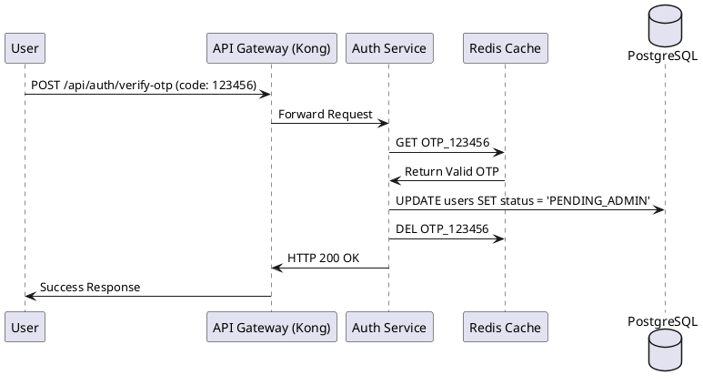

# Multi-Layered Caching & Storage Strategy

HRM System employs optimization at multiple levels to ensure sub-200ms response times for critical operations and to handle high-concurrency periods (e.g., morning check-ins).

### 1. Edge / Gateway Level
*   **Technology:** Kong API Gateway & Nginx.
*   **Optimizations:**
    *   **Rate Limiting Counters:** Stored efficiently in Kong's memory/DB-less mode to instantly reject abusive requests before they reach the microservices.
    *   **Reverse Proxy:** Nginx acts as a load balancer and handles static assets serving for the frontend React application.

### 2. In-Memory Caching (Redis)
*   **Technology:** Redis 7 (Alpine).
*   **Use Cases:**
    *   **Ephemeral Data (OTP):** Stores 6-digit registration/password reset OTPs with an strict TTL (Time-To-Live) of 5 minutes.
    *   **Session Invalidations:** Token blacklisting logic for secure user logouts.
    *   **Pub/Sub Messaging:** Acts as the high-speed Event Bus connecting multiple `Socket.io` instances, ensuring that an event fired from the Leave Service instantly reaches the correct Manager's WebSocket connection.

### 3. Database Level Optimization
*   **PostgreSQL (Relational):**
    *   Connection pooling managed natively through `pg` library interacting with `HAProxy`.
    *   B-Tree indexing on foreign keys (`user_id`, `department_id`) to accelerate `JOIN` queries during Payroll calculation.
*   **MongoDB (NoSQL):**
    *   Optimized for Write-heavy operations. Captures JSON-based Audit Logs without strict schema constraints, ensuring main relational transactions are never bottlenecked by auditing requirements.

### 4. Visual Flow: OTP Caching & Verification

