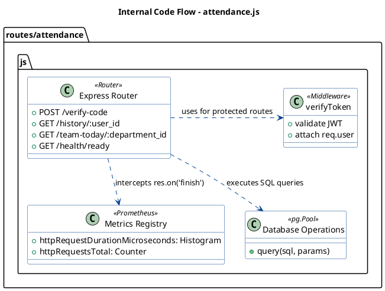

# 💻 C4 Level 4 – Code Diagram (Attendance Service Internals)

### 1. Description
Visualize the internal logical flow within the `attendance.js` route file. This diagram focuses on how a single Express router file orchestrates database connections, observability registries, and request processing.

### 2. Code Component Description
*   **Dependencies:** `express`, `jsonwebtoken` (Security), `prom-client` (Observability), `pg` (Database).
*   **Registry & Metrics Setup:** Initializes counters and histograms directly at the file level.
*   **Endpoints:**
    *   `/verify-code`: Executes the core upsert logic (`ON CONFLICT (user_id, work_date) DO UPDATE`) to guarantee idempotency.
    *   `/history/:user_id`: Fetches data, dynamically applying date filters.
    *   `/health/ready`: Performs live pings to PostgreSQL, Redis, and checks Disk Space.

### 3. PlantUML Diagram
