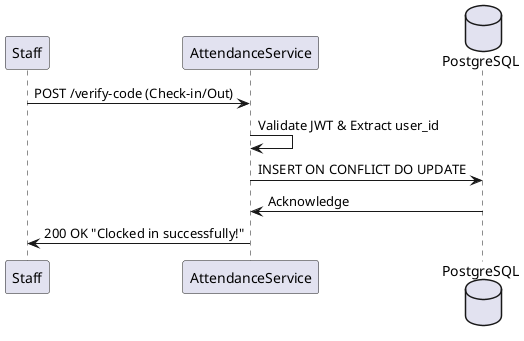

# ⏱️ Attendance Service: Time Tracking & Activity Stream

### 1. Domain
Responsible for recording employee clock-in and check-out times, cross-referencing with system settings to automatically classify statuses: Late, Early Leave, On Time, etc.

### 2. Performance & Resiliency
*   **High Write Throughput:** Attendance requests typically spike at 08:00 AM and 05:00 PM. Utilizing **PostgreSQL HA (Spilo/Patroni)** alongside **HAProxy** as a Load Balancer helps distribute the write load effectively.
*   **Metrics & Observability:** Integrates directly with `prom-client` to collect `http_request_duration_seconds`. This data is pushed to **Prometheus & Grafana** to alert administrators when the `/verify-code` API shows signs of bottlenecking.
*   **Health Checks:** Exposes standard Kubernetes/Docker-compliant endpoints (`/health/live` and `/health/ready`) to cross-check DB, Redis, and disk space statuses.

### 3. Core Logic
*   **Upsert Logic:** Employs the `ON CONFLICT (user_id, work_date) DO UPDATE` clause in PostgreSQL to ensure *Idempotency*. Even if a user clicks Check-in multiple times a day, the system only updates the device and timestamp without creating garbage records.

