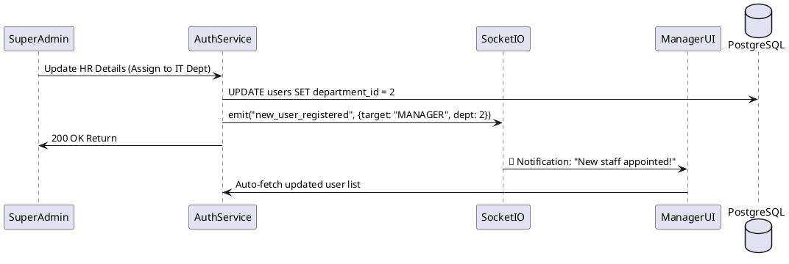

# 🔐 Auth Service: Security, Identity & Organization Center

### 1. Domain
Serves as the "Heart" of the system (Source of Truth), managing user identities (Identity), system authorization (RBAC - SUPERADMIN, MANAGER, STAFF), and the organizational department structure.

### 2. Technical Strategy & Data Flow
*   **Authentication & Security:** Uses **Bcrypt** for password hashing at the database layer (via pgcrypto or application level). Generates stateless **JWTs** serving as access tokens for the entire ecosystem.
*   **Data Isolation:** All queries to the employee list (`/users`) are strictly filtered at the SQL level based on the requester's `role` and `department_id`, ensuring Managers can only view personnel within their own department.

### 3. Event-Driven Sync
*   **Real-time UI Update:** Whenever a Superadmin changes an employee's department or approves a new account (`PUT /:id/status`), the Auth Service emits a `new_user_registered` event via **Socket.io**.
*   **Action:** The Manager of the corresponding department immediately receives a notification ("Your department has a newly appointed staff member") and the UI updates automatically without requiring a page reload.

