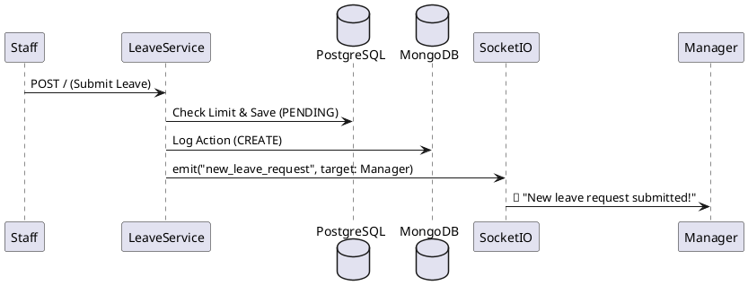

# 📅 Leave Service: Workflow Orchestration & Scheduling

### 1. Domain
Manages the entire lifecycle of leave requests (Create -> Pending -> Approved/Rejected), tracks leave balances, and generates the aggregated weekly work schedule.

### 2. Architecture & Workflow
*   **Hierarchical Approval:** Staff submits -> Manager approves. Manager submits -> Director approves. Utilizes algorithms to prevent IDOR (Insecure Direct Object Reference) at the API level, ensuring users cannot view or approve others' requests unauthorized.
*   **Hybrid Data Logging:** 
    *   *Standard Data (ACID):* Stored securely in PostgreSQL.
    *   *Audit/Log Data:* Approval history and status changes (e.g., from PENDING to APPROVED) are serialized into JSON and written at high speed to a **MongoDB Replica Set** (`LeaveLog`).

### 3. Cross-Domain Aggregation
*   The `/schedule/weekly` API acts as a complex Aggregator. It merges data from 3 distinct sources: **Users** (HR Info) + **Attendance Logs** (Actual work hours) + **Leave Requests** (Approved time off). 
*   **Dynamic Calculation:** Integrates with "Holidays" data retrieved from the `system_settings` table to accurately plot a comprehensive 7-day schedule matrix.

