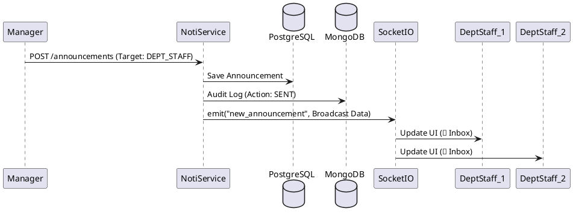

# 🔔 Notification Service: Real-time Engagement & Broadcasting

### 1. Domain
Functions as the central internal broadcasting station. Reacts to system events and allows management to dispatch urgent announcements to personnel.

### 2. Technical Strategy
*   **Event-Driven Architecture (EDA):** Facilitates 2-way real-time interactions via **WebSockets (Socket.io)**.
*   **Smart Routing:** Allows notifications to be routed through a multidimensional Target Matrix:
    *   `ALL`: System-wide broadcast.
    *   `ROLE`: Exclusively to Managers.
    *   `DEPT_STAFF`: Localized to a specific department.
    *   `INDIVIDUAL`: Direct, private messaging.
*   **Read Receipts:** Utilizes `announcement_reads` in PostgreSQL to track read history. Provides an `unread_count` API to render real-time notification badges on the UI.

### 3. Logging & Analytics
*   Every sent announcement (`SENT`) and user view action (`READ`) is pushed asynchronously to the **MongoDB Replica Set** (`NotificationLog`). This guarantees the system doesn't experience lag even when thousands of users click to view a notification simultaneously.

